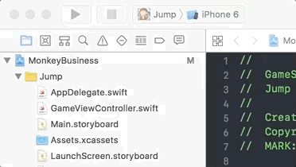
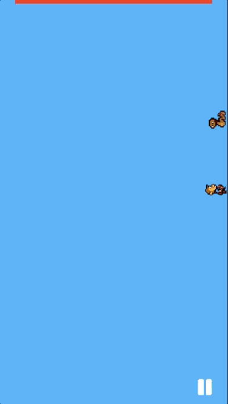

# Monkey Business

This is a gravity-based iOS game built in sprite kit. The game is a platformer-style game that is played on all four sides of the phone.

## Getting Started

These instructions will get you a copy of the project up and running on your local machine for development and testing purposes. See deployment for notes on how to deploy the project on a live system.

### Prerequisites

What things you need to install the software and how to install them

```
XCode 8 or above
optional- iOS device
```

### Installing

* Open the xcworkspace file in XCode
* Choose your iOS device or simulator 
* Click Run!

### Playing!


## Built With

* [Sprite Kit](https://developer.apple.com/documentation/spritekit) - The main framework used

## Authors

* **Andrew Tsukuda** - *Lead* - [Tsukudabuddha](https://github.com/tsukudabuddha)

See also the list of [contributors](https://github.com/tsukudabuddha/MonkeyBusiness/contributors) who participated in this project.

## License

This project is licensed under the MIT License - see the [LICENSE.md](LICENSE.md) file for details

## Acknowledgments

* Michael - `print()`
* Enzo - `.gravity = None`
